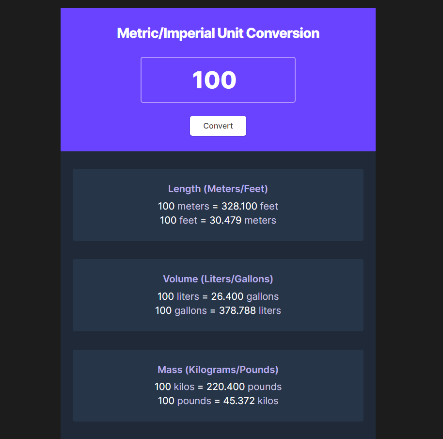

# Unit-Conversion

## Table of Contents

- [Unit-Conversion](#unit-conversion)
  - [Table of Contents](#table-of-contents)
  - [Project Overview](#project-overview)
  - [Demo](#demo)
  - [Key Features](#key-features)
  - [How to Use](#how-to-use)
  - [Contributing](#contributing)
  - [License](#license)

## Project Overview

This is a solo project completed as part of the Scrimba Front-End Path. It consists of a simple application that allows you to convert between different units of measurement such as meters to feet, liters to gallons, and kilos to pounds.



## Demo

- Live demo: [Unit Conversion](https://dz-unit-conversion.netlify.app/)

## Key Features

- Convert between different units of measurement (length, volume, and mass).
- User-friendly interface with input and conversion result displays.
- Easily extendable to support additional units or conversions.

## How to Use

1. **Clone the repository**:

First, you'll need to clone this repository to your local machine. Open your terminal and run the following command:

```git
git clone https://github.com/hichamweblog/Unit-Conversion.git
```

2. **Navigate to the Project Folder**:

Change your working directory to the newly cloned project folder:

```git
 cd Unit-Conversion
```

3. **Install Dependencies**:

Install the required packages by running:

```git
npm install
```

4. **Run the project**:

```git
npm run dev
```

This command will launch a development server, and you'll be able to view the website locally in your web browser.

## Contributing

If you would like to contribute to this repository, feel free to open issues or submit pull requests. Contributions and improvements are always welcome.

## License

This project is licensed under the [MIT License](./LICENSE).
